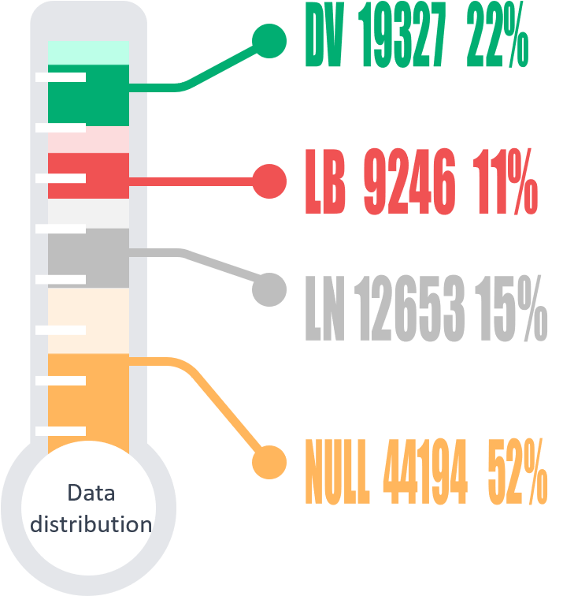

2019 Legal AI Challenge: Legal Case Element Recognition solution.（2019年法研杯要素识别冠军方案）


Explanation in English: [https://wangxupeng.github.io/project/legal-ai-challenge/](https://wangxupeng.github.io/project/legal-ai-challenge/)

中文介绍：https://zhuanlan.zhihu.com/p/628656798

Detailed comments have been written in the code, please pay special attention to the parts where data is read and where the label tokens are retrieved.


## __Task Introduction__
The main objective of this task is to automatically extract important factual descriptions from case descriptions, and classify them according to a case element system designed by domain experts. Essentially, it is a short-text multilabel classification problem.

The results of case element extraction can be used in practical business requirements in the judicial field, such as case summaries, explainable case recommendations, and related knowledge recommendations.

Specifically, given relevant paragraphs in judicial documents, the system needs to judge each sentence in the document and identify the key case elements.

This task involves three domains, including marriage and family, labor disputes, and loan contracts.

## __Data Introduction__
The dataset used for this task mainly comes from the publicly available legal documents on the 'China Judgments Online' website. Each training data consists of a segment of the case description from a legal document, where each sentence has been labeled with corresponding category tags (it should be noted that the number of category tags for each sentence is not fixed). For example:

{"labels": ["DV9", "DV1", "DV2"], "sentence": "The plaintiff Xie Chunyou claimed that the plaintiff and defendant divorced in March 2014 due to emotional discord as ruled by the Hengyang County People's Court, and ruled that their daughter Zhou Yin (born on September 8, 2001, now studying at Zhengyang Middle School, Xidu Town, Hengyang County) would be raised by the defendant."}; DV represents the divorce category.

{"labels": ["LB2", "LB3"], "sentence": "The plaintiff Zhang Qian filed a lawsuit with the court and requested: 1. To order the defendant to make up the plaintiff's salary of 7200 yuan and compensation of 2400 yuan."}; LB represents the labor category.

{"labels": ["LN2", "LN6", "LN4"], "sentence": "This court finds the facts as follows: The defendant's brothers holdings group limited company borrowed three loans from the Industrial and Commercial Bank of China Yongkang Branch, with a total principal of RMB 40 million, as follows:"}; LN represents the loan category.

#### Label contents are as follows:

```python
Divorce = 
["Children born during marriage",
"Child custody for children with limited capacity for civil conduct",
"Common property of husband and wife",
"Payment of child support",
"Division of real estate",
"Separation after marriage",
"Divorce for the second time",
"Monthly payment of child support",
"Granting of divorce",
"Common debt of husband and wife",
"Personal property before marriage",
"Statutory divorce",
"Failure to perform family obligations",
"Existence of illegitimate child",
"Proper assistance",
"Failure to fulfill divorce agreement",
"Compensation for damages",
"Living separately for more than two years due to emotional discord",
"Children living with non-custodial parent",
"Personal property after marriage"]

Labor = 
["Termination of Labor Relationship",
"Payment of Wages",
"Payment of Economic Compensation",
"Unpaid Full Labor Remuneration",
"Existence of Labor Relationship",
"No Labor Contract Signed",
"Signed Labor Contract",
"Payment of Overtime Pay",
"Payment of Double Wages Compensation for No Signed Labor Contract",
"Payment of Work-Related Injury Compensation",
"No Labor Arbitration Filed",
"Refusal to Pay Illegal Termination Compensation",
"Economic Layoff",
"No Payment of Bonuses",
"Illegally Collecting Property from Employees",
"Special Job Categories",
"Payment of Subsidies for Work Injury, Funeral or Bereavement",
"Advance Notification of Termination by Employer",
"Legal Person Status Ceased",
"Agreement Reached through Mediation"]

Loan = 
["Transfer of creditor's rights",
"Loan amount of x thousand yuan",
"Loan certificate available",
"Lender is a financial institution",
"Repayment of loan",
"Loan borrowed by company|unit|other organization",
"Joint guarantee",
"Reminder for repayment",
"Payment of interest",
"Establishment of guarantee contract",
"Written promise of repayment available",
"Invalid|revoked|terminated guarantee contract",
"Refusal to perform repayment",
"Release of guarantor's guarantee responsibility",
"Guarantor not assuming guarantee responsibility",
"Pledgor is a company",
"Lender fails to provide loan as agreed in terms of date or amount",
"Loan borrowed by multiple individuals",
"Transfer of debt by debtor",
"Unclear agreed interest rate"]
```

#### Split multi-labels into single labels and then count:

